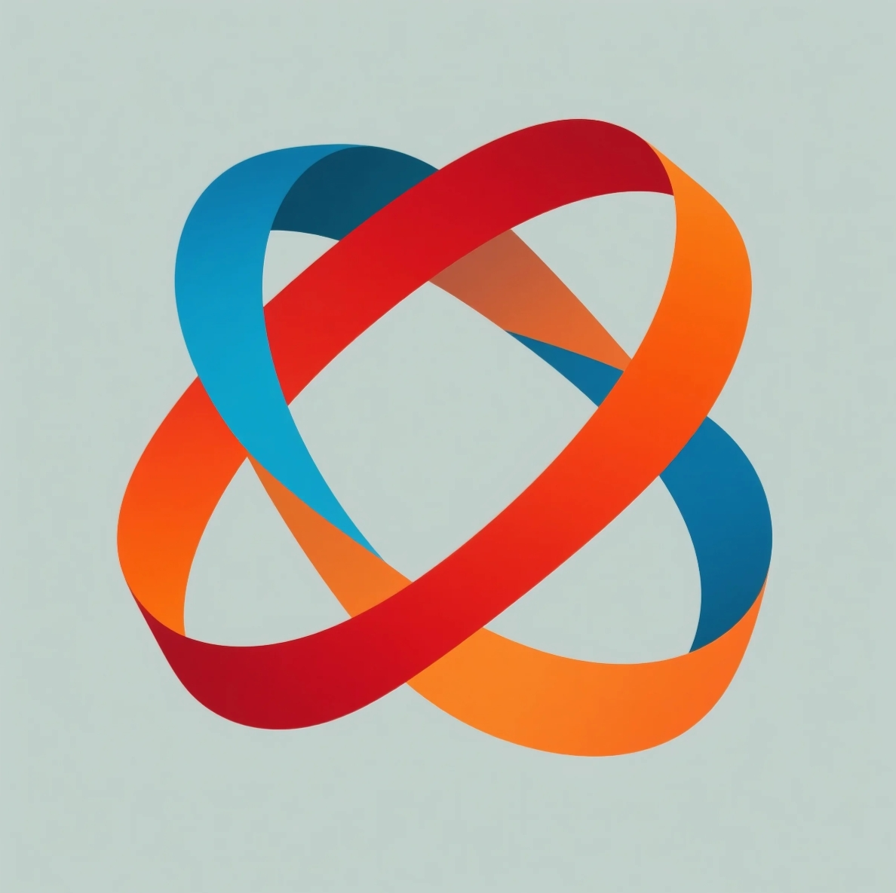

<div align="center">
  
  <h1>Visual Creativity</h1>
  <p>
    <strong>Transform Image Creation into Programmable Engineering</strong>
  </p>
  <p>
    <a href="https://www.visualcreativity.top">Website</a> ·
    <a href="docs/guides/quick-start.md">Quick Start</a> ·
    <a href="docs/api/reference.md">API</a> ·
    <a href="https://x.com/Visual_SOL">Twitter</a>
  </p>
</div>

## Overview

Visual Creativity is an innovative AI-powered visual creation platform that transforms image creation into a programmable engineering process. Our platform empowers users to become "visual engineers" through intuitive programmatic interfaces and advanced AI technology.

The platform leverages state-of-the-art Diffusion Transformer (DiT) architecture to enable multi-subject, context-aware image generation through intuitive programmatic interfaces (JSON, Python API). Users can define generation rules and create unique visual content for various applications including e-commerce, entertainment, fashion design, education, and cultural preservation.

## Key Features

- **AI Programmatic Generation**: Create high-quality visual content using JSON, Python API, or DSL interfaces
- **Multi-Subject Generation**: Generate complex scenes with multiple subjects and dynamic effects
- **Real-Time Processing**: 2-3 second generation time for 4K images
- **Cross-Platform Support**: Available on web, iOS, and Android platforms
- **Developer-Friendly**: Comprehensive API documentation and SDK support

## Technical Architecture

### Core Components

- **Diffusion Transformer (DiT)**
  - 32-layer Transformer architecture
  - 12 million parameters
  - Trained on 1 billion diverse images
  - 92% generation accuracy

- **CLIP Encoder**
  - Converts rules into 512-dimensional embeddings
  - Enables precise cross-attention control
  - Supports natural language understanding

### Implementation Examples

#### JSON Interface

```json
{
  "subjects": [{
    "type": "person",
    "clothing": "bohemian_dress",
    "pose": "standing",
    "position": {"x": 0.5, "y": 0.6}
  }],
  "background": {
    "scene": "sunset_beach",
    "lighting": "golden_hour",
    "atmosphere": "warm"
  },
  "style": {
    "artistic_influence": "impressionism",
    "color_palette": "warm_tones"
  }
}
```

#### Python API

```python
from visual_creativity import Generator, Scene, Subject

# Initialize the generator
generator = Generator(model="dit-large-v2")

# Create a scene
scene = Scene(
    background="sunset_beach",
    lighting="golden_hour",
    atmosphere="warm"
)

# Add subjects
subject = Subject(
    type="person",
    clothing="bohemian_dress",
    pose="standing",
    position=(0.5, 0.6)
)
scene.add_subject(subject)

# Generate image
image = generator.generate(
    scene,
    style={
        "artistic_influence": "impressionism",
        "color_palette": "warm_tones"
    },
    size=(1024, 1024)
)
image.save("generated_scene.png")
```

#### DSL Example

```ruby
scene "sunset_beach" {
  lighting "golden_hour"
  atmosphere "warm"
  
  person {
    wearing "bohemian_dress"
    pose "standing"
    at position(0.5, 0.6)
  }
  
  style {
    influence "impressionism"
    colors "warm_tones"
  }
}
```

## Project Structure

```
├── docs/                    # Documentation files
│   ├── api/                 # API documentation
│   ├── guides/              # User and developer guides
│   ├── architecture/        # Technical architecture docs
│   └── community/           # Community guidelines
├── examples/                # Example code and templates
├── architecture/            # Architecture diagrams and specs
└── community/              # Community resources and guidelines
```

## Getting Started

Please refer to our comprehensive documentation:

- [Quick Start Guide](docs/guides/quick-start.md)
- [Developer Documentation](docs/guides/developer-guide.md)
- [API Reference](docs/api/reference.md)
- [Architecture Overview](docs/architecture/overview.md)

## Development Status

The platform is currently in active development. We follow an iterative development process with regular updates and improvements based on community feedback.

## Contributing

We welcome contributions from the community! Please read our [Contributing Guidelines](docs/community/contributing.md) to get started.

## Community

- [Community Guidelines](docs/community/guidelines.md)
- [Code of Conduct](docs/community/code-of-conduct.md)
- [Support](docs/community/support.md)
- Follow us on [Twitter/X](https://x.com/Visual_SOL)

## License

This project is licensed under the MIT License - see the [LICENSE](LICENSE) file for details.

## Contact

For support and inquiries, please refer to our [Support Guide](docs/community/support.md).